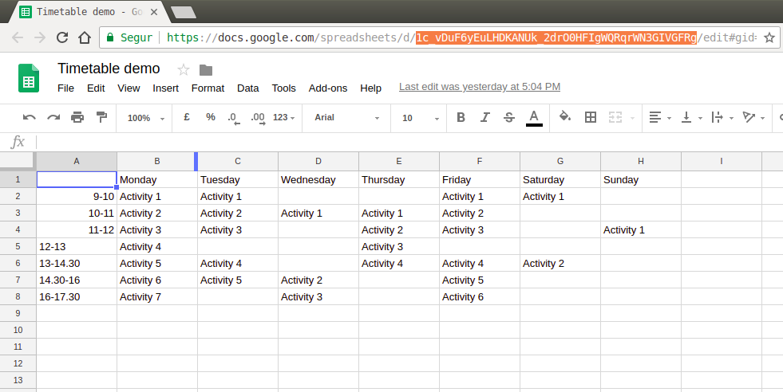

# Google Spreadsheet to HTML Timetable 

## Motivation

* Allows non-tech users to edit a timetable in Google Spreadsheet and then, publish it to a web page.
* It has two versions:
	* Desktop (same view as spreadsheet)
	* Responsive (splits column headers -monday, ..., sunday- as new rows)

## Prerequisites & requirements

* JQuery
* A spreadsheet and make it public ("publish to the web" option)
	* Get the id of the spreadsheet from the url (from the sample: _1c_vDuF6yEuLHDKANUk_2drO0HFIgWQRqrWN3GIVGFRg_)

	

## Install & Usage

* Download and put in your js assets [/lib/jquery.gshtmltable.js](/lib/jquery.gshtmltable.js)
* Invoke $.drawTables() from your html page

```javascript
	<script src="https://code.jquery.com/jquery-3.3.1.min.js"></script>
	<script src="lib/jquery.gshtmltable.js"></script>
	<script>
		$.drawTables();
	</script>
```

* It will paint two tables:
	* one with the same form of the spreadsheet (n rows x n cols)
	* one responsive, adapted to mobile

* You can pass some options to drawTables()

```javascript
	<script>
		$.drawTables({
			'spreadsheet' : 'id of your spreadsheet',
			'desktop_container' : '# id of your container for desktop table, with "#" or ".", default "body"',
			'responsive_container' : '# id of your container for responsive table, with "#" or ".", default "body"',
			'desktop_css' : 'desktop css to add to class attribute',
			'responsive_css' : 'responsive css to add to class attribute',
			'responsive_css_th' : 'css classes to add to first spreadsheet row columns',
			'callback' : 'function, when all work is done...'
		});
	</script>
```

* if desktop_container or responsive_container are null, painting won't be processed.

## Demo
	
* [Sample](https://rawgit.com/davidayalas/gspreadsheet-html-timetable/master/samples/index.html)
* Live site: https://irespira.cat#horari
	