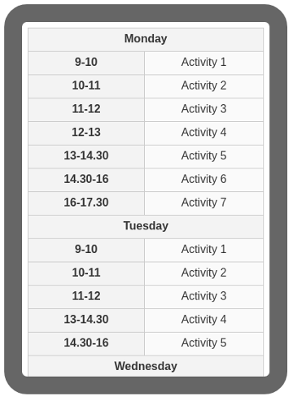

# Google Spreadsheet to HTML Timetable 

## Motivation

* Allows non-tech users to edit a timetable in Google Spreadsheet and then, publish it to a web page.
* It has two versions:
	* Desktop (same view as spreadsheet)
	* Responsive (splits column headers -monday, ..., sunday- as new rows)

## From spreadsheet to HTML

From this


you will get this


or this




## Prerequisites & requirements

* A spreadsheet and make it public ("share" options, anyone with the link can read)
	* Get the id of the spreadsheet from the url (from the sample: _1c_vDuF6yEuLHDKANUk_2drO0HFIgWQRqrWN3GIVGFRg_)


* Create a new project in https://console.cloud.google.com/
	* Enable Google Spreadsheet API
	* In credentials, create an API KEY
	* Restrict API KEY to Google Sheets

## Install & Usage

* Download and put in your js assets [/lib/gshtmltable.js](/lib/gshtmltable.js)
* Invoke drawTables() from your html page

```javascript
	<script src="lib/gshtmltable.js"></script>
	<script>
		drawTables();
	</script>
```

* It will paint two tables:
	* one with the same view of the spreadsheet (n rows x n cols)
	* one responsive, adapted to mobile

* You can pass some options to drawTables()

```javascript
	<script>
		drawTables({
			'spreadsheet' : 'id of your spreadsheet',
			'desktop_container' : '# id of your container for desktop table, with "#" or ".", default "body"',
			'responsive_container' : '# id of your container for responsive table, with "#" or ".", default "body"',
			'desktop_css' : 'desktop css to add to class attribute',
			'responsive_css' : 'responsive css to add to class attribute',
			'responsive_css_th' : 'css classes to add to first spreadsheet row columns',
			'callback' : 'function, when all work is done...'
		});
	</script>
```

* if desktop_container or responsive_container are null, its painting won't be processed.

## Recommended

Maybe you want to put the request to Google Sheets API behind a proxy to avoid the exposition of your API KEY, and you can cache the JSON output and invalidate when you want.

## Demo
	
* [Sample](https://rawcdn.githack.com/davidayalas/gspreadsheet-html-timetable/73c0fce746b8b8d8d098e7ba9c9962bbca373bf0/samples/index.html)
* Live site: https://irespira.cat#horari
	
